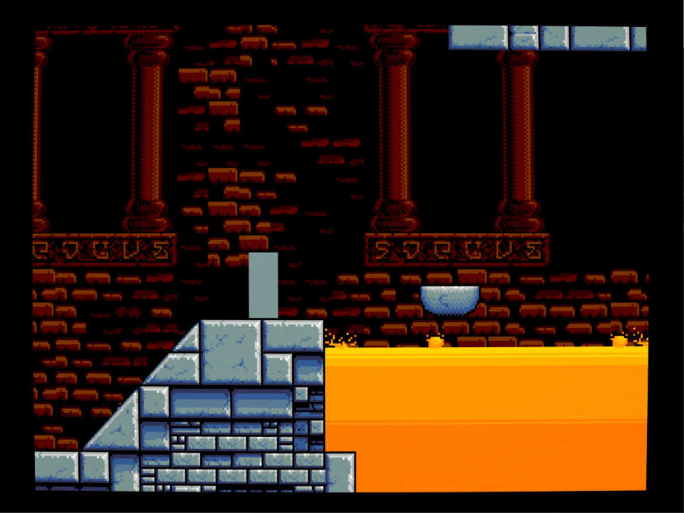

# UltraDrive

DISCONTINUED

Project to learn how and also how not to implement a game engine for the [Sega Mega Drive/Genesis](https://en.wikipedia.org/wiki/Sega_Genesis).

The following features have been implemented:
- [Tiled](https://www.mapeditor.org/) map support
  - Very large map support for both foreground and background
  - Reusable tilesets
    - 8x8 meta tiles of 2x2 pattern meta tiles with support for priority at the pattern level
    - Collision data (height field + angle)
    - Animations
        - Timer scheduled
        - Manually scheduled
        - Camera movement scheduled
  - Foreground and background map coupling
  - Uses a text template engine for Tiled data conversion
      - As a consequence the map conversion tool can be easily plugged into any project (language independent)
      - Meta tiles and static pattern data are compressed in ROM ([comper](https://github.com/flamewing/mdcomp/blob/master/src/asm/Comper.asm) but [slz](https://plutiedev.com/format-slz) also supported)
- Map collision detection routines
  - floor/ceilings
  - walls
- 3 and 6 button controller support on both controller ports
- Independent camera with map streaming support for foreground and background
    - Background behavior can be configured in the map editor (Tiled)

## How to run
### Prerequisites
The following tools should be on your PATH
- [BlastEm](https://www.retrodev.com/blastem/) emulator
- asm68k
- java (>=11)
- maven (>=3)
- sh (to run directly from Tiled. for windows the one supplied with gcc will work)

### Build MapConvert
To build the Tiled map conversion tool run the script `./build_tools.sh`

### Run directly from Tiled
- Open the Tiled project workspace file in `./game/assets/map/`
- Press `alt+r` to compile the map and run the project in BlastEm

### Run on real hardware
Create a ROM image `boot.bin` by runnin the following command from the source root: `asm68k.exe /p .\assembly.asm,boot.bin`.
Put `boot.bin` on a flash card like the Everdrive and run from there.

## Debug build
This adds Gens KMod debug support (Debug message and timers) which can be used in the Gens KMod and Exodus emulators.

Run asm68k from the command line in the source root:
`asm68k.exe /p /e "DEBUG='GENS'" .\assembly.asm,boot.bin`

This produces a ROM image `boot.bin` which can be loaded in an emulator that supports the kmod debug protocol.

# Example

